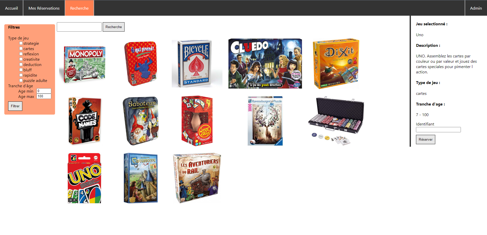

# Ludothèque - A (board game) library management system
A small website created for a school project in which the administrator can fill the game catalogue with new games (and their attributes) and users can browse and borrow them. The website features a search page with filters and a search bar to narrow down games.

